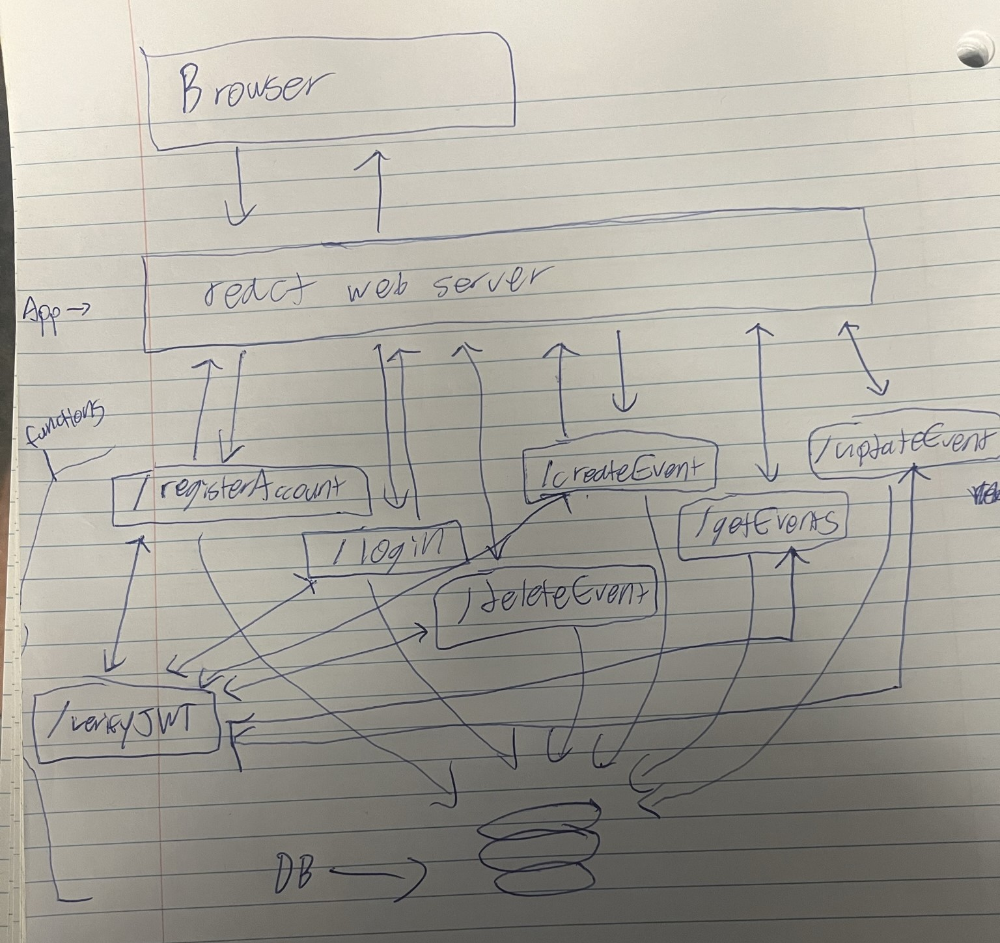

# Architecture:
by owen

## Simple drawing:

## App:
React app made by owen hosted by either google app engine or just a vm. Will have 2 pages: login and calender. On the calendar the user can click on a day to see the events blown up for the day (basically see descriptions too rather than just titles). From login page you register and log in, from calendar you see all events, or create update delete a given event.

## Functions:
Functions will serve as the api layer for the app and will communicate via json over HTTP/HTTPS with the app layer. There are basically 2 classes of functions we will need:

### First is the auth/user functions:

### Register:

Inputs:
        
        {
            username:
            password:
            fname:
            lname:
        }

Outputs:

        {
            success: (T/F)
        }

### Login:
        
Inputs:
        
        {
            username:
            password:
        }

Outputs:

        {
            jwt:
            uid:
        }

### Verify JWT:

Inputs:
        
        {
            jwt:
            uid:
        }

Outputs:

        {
            success: (T/F)
        }

### Second are the calendar functions:

### Get all events:

### Create event:

### Update event:

### Delete event:

Each need in the two function classes can be done as its own function, or these two sets can each be their own function but its up to you. Technically each function is supposed to do one specific thing, but I dont think it matters. Just lmk which you choose and the endpoints I am supposed to be hitting. If you choose to do this as two functions, we can add a field to the input that specifies which specific functionality needs to be accessed by the function.

## DB:
This is Shivani's purview, I will not be interacting with this layer so I do not know what would be best.

## Integration:
Nicks problem: figure out how this stuff all needs to be connected and what the best platform to host the react app would be. Also know the architecture well so connection between db and functions can happen early so that they can be tested.